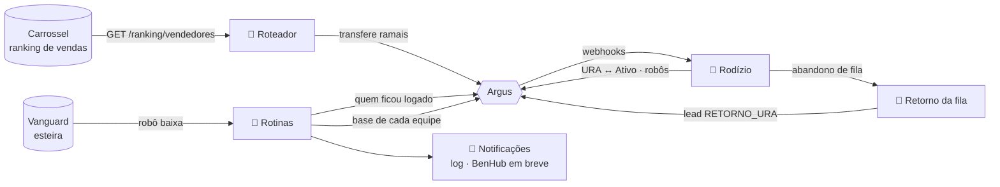
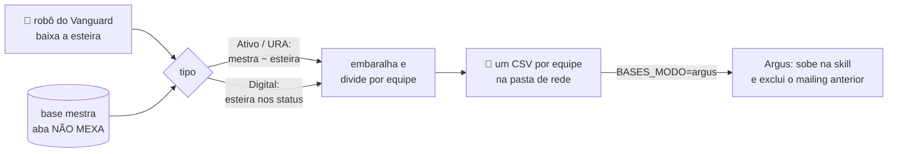
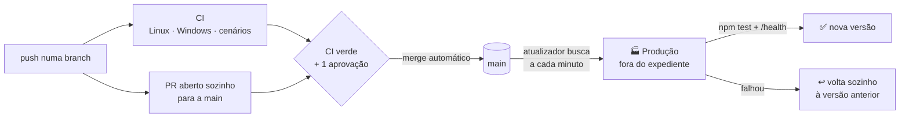

<div align="center">

# 📞 BenURA

**Automações da discadora Argus**<br>
roteador de vendas · rodízio da URA · retorno de quem desistiu da fila · rotinas de fim de expediente

[](https://github.com/nanzinx/Benura/actions/workflows/ci.yml)


[Início rápido](#inicio-rapido) ·
[Roteador](#roteador) ·
[Rodízio](#rodizio) ·
[Retorno da fila](#retorno-da-fila) ·
[Fim de expediente](#fim-de-expediente) ·
[Bases](#bases) ·
[PM2](#pm2) ·
[Esteira](#esteira)

</div>

---

## 📚 Sumário

- [Visão geral](#visao-geral)
- [Início rápido](#inicio-rapido)
- [🚦 Roteador de Vendas](#roteador)
- [👤 Cadastro de operadores (Vanguard → Argus)](#cadastro)
- [🔄 Rodízio Ativo ↔ URA e robôs](#rodizio)
- [📲 Retorno de quem desistiu da fila](#retorno-da-fila)
- [🌙 Fim de expediente limpo](#fim-de-expediente)
- [📦 Bases de mailing (Ativo, URA, Digital)](#bases)
- [🧰 Rodando com PM2](#pm2)
- [🚀 Esteira automática](#esteira)

<a id="visao-geral"></a>
## 🧭 Visão geral

| Script | App no PM2 | Porta | O que faz |
|---|---|---|---|
| `roteador-vendas.js` | `benura-roteador` | 3001 | Distribui vendedores entre **URA** e **Ativo** com base nas vendas da **API do Carrossel** |
| `argus-automacao.js` | `benura-rodizio` | 3000 | Rodízio Ativo ↔ URA por atendimento, liga/desliga os robôs da URA e faz o **retorno de quem desistiu da fila** |
| `rotinas.js` | `benura-rotinas` | 3003 | Rotinas: **fim de expediente limpo** e **bases de mailing** (Ativo, URA, Digital) |
| `atualizador.js` | `benura-atualizador` | 3002 | Deploy automático na máquina de produção, fora do expediente |
| `cadastrar-operador.js` | — | — | Prepara e confere o cadastro de operadores na Argus a partir do login no **Vanguard** |



> [!NOTE]
> Toda automação nova nasce **desligada** ou em modo **só relatar**, e todas respeitam `DRY_RUN=1` (registra o que faria, sem mexer em nada).

<a id="inicio-rapido"></a>
## ⚡ Início rápido

```bash
npm install
cp .env.example .env     # URL do Carrossel, token da Argus, GRUPO_URA_ID e GRUPOS_ATIVOS_IDS
npm run dev              # tudo simulado em memória, sem rede
npm test                 # testes unitários
npm run test:cenarios    # cenários do rodízio contra uma Argus falsa
```

> [!TIP]
> No **PowerShell**, use `copy .env.example .env`. Para variáveis de ambiente, use `$env:NOME='valor'; npm run ...`.

---

<a id="roteador"></a>
## 🚦 Roteador de Vendas

### Regras de negócio
1. **Carga inicial** (primeiro ciclo do expediente): quem vendeu **mais** que `META_DIARIA` no dia útil anterior vai para a URA.
   Os demais, inclusive quem não vendeu nada, vão para o Ativo, no grupo **do próprio supervisor**.
2. **Gatilho**: quem está no Ativo e faz qualquer venda hoje sobe para a URA e fica lá até o fim do dia.
3. **Reset**: no dia seguinte (no fuso `FUSO_HORARIO`) o ciclo recomeça.

### Como rodar
```bash
npm start
```
| Modo | Comando |
|---|---|
| Sem rede (Carrossel e Argus em memória) | `npm run dev` |
| Simulação completa com PM2 | veja [Rodando com PM2](#pm2) |
| Mock HTTP de Carrossel + Argus | `npm run mock` (veja `.env.example`) |

### Independência da URA
O `DiscadoraService` é a única porta para a Argus e segue estas regras:
- **A Argus é a fonte da verdade**: antes de transferir, consulta em que grupo o ramal está.
- **Idempotência**: se o ramal já está no destino (ex.: movido à mão), nada é enviado.
- **Grupos externos respeitados**: quem foi colocado manualmente em outro grupo (treinamento, supervisão…) não é puxado de volta (`RESPEITAR_GRUPOS_EXTERNOS=1`).
- **Sem reconciliação contínua**: o roteador só age em eventos (carga do dia, venda detectada), nunca "corrige" a URA periodicamente.
- **Falhas não derrubam nada**: transferências que falharam ficam pendentes e são tentadas de novo (até 5×/dia).
- **Ativo = grupo do supervisor**: o Ativo são vários grupos (`GRUPOS_ATIVOS_IDS`), um por supervisor.
  Quem já está em qualquer um deles fica onde está; quem volta da URA vai para o grupo do próprio supervisor.

### API do Carrossel
Consome `GET {CARROSSEL_API_URL}/ranking/vendedores` do Carrosel-BenApi, que devolve
`{ hoje: [...], ontem: [...], semanal, mensal, ultimaExtracao, diaOntem }`.
- **Total vendido**: campo `CARROSSEL_METRICA` (padrão `vendaConcluida`) da linha `GERAL` de `performance`.
- **"Ontem"** é o dia útil anterior calculado pelo próprio Carrossel (pula fim de semana e feriados).
- **Atualização**: o Carrossel refaz o scraping a cada 6 min; um poll de 1 min é suficiente.
- Se o Carrossel responder `ultimaExtracao: "Erro"` ou vier sem vendas de ontem, a carga do dia é adiada e tentada de novo.
- Só `src/integrations/carrossel/carrossel.mapper.js` conhece esse formato.

### Vendedor do Carrossel → ramal da Argus (automático)
O Carrossel identifica vendedores **só pelo nome**; a Argus só entende **ramal**. A ponte é feita
automaticamente pelo `/listarusuarios` da Argus, que traz nome, login, ramal, grupo e supervisor de todos os usuários.
- Nomes são comparados sem acento, maiúsculas ou espaços extras.
- **Universo da carga**: operadores ativos que estão hoje na URA ou em algum grupo do Ativo. Quem não aparece no "ontem" do Carrossel vendeu R$ 0.
- **Grupo de cada supervisor**: inferido pelo grupo do Ativo onde está a maioria dos operadores dele (não depende do nome do grupo).
- **Exceções** (opcionais, relidas sem reiniciar):
  - `vendedores-ramais.json`: nome no Carrossel diferente do nome na Argus, ou homônimos: `{ "NOME NO CARROSSEL": "2266111" }`
  - `supervisores-grupos.json`: supervisor cujo grupo não é identificado: `{ "NOME DO SUPERVISOR": 12 }`

### Endpoints HTTP do roteador
| Método | Rota | Auth | Descrição |
|---|---|---|---|
| `GET` | `/health` | — | saúde do serviço |
| `GET` | `/status` | — | vendedores por fila, pendências |
| `POST` | `/recarregar` | 🔒 token | refaz a carga inicial |
| `POST` | `/webhook/venda` | 🔒 token | `{ "ramal": "1004", "valor": 1500 }` |

Token: `Authorization: Bearer <WEBHOOK_TOKEN>` ou `X-Webhook-Token: <WEBHOOK_TOKEN>`.

<details>
<summary><b>🏗️ Arquitetura (pastas)</b></summary>

```
roteador-vendas.js                 ponto de entrada
src/app.js                         composition root + ciclo de vida
src/config/                        variáveis de ambiente (dotenv) + validação
src/http/server.js, controllers.js rotas → controladores (sem regra de negócio)
src/services/roteamento.service.js casos de uso: carga inicial, monitoramento, webhook
src/services/agendador.js          loop único, sem sobreposição, respeita expediente
src/domain/                        regras puras (meta, gatilho, rodízio, retorno da fila, fim de expediente)
src/integrations/carrossel/        client HTTP → mapper (anti-corrupção) → service (fallback)
src/integrations/argus/            client HTTP → DiretorioOperadores (usuários) → DiscadoraService (isola a URA)
src/integrations/vanguard/         fonte de dados de funcionários (hoje: manual)
src/services/cadastro-operador.service.js  planejar / conferir cadastro de operador
src/repositories/                  estado diário, exceções de ramal, auditoria (JSONL)
src/rodizio/                       rodízio Ativo ↔ URA e robôs
src/retorno-fila/                  retorno de quem desistiu da fila
src/rotinas/                       rotinas diárias (fim de expediente)
src/notificacoes/                  avisos (log hoje; BenHub depois)
src/atualizador/                   deploy automático
src/utils/                         HTTP com retry, persistência atômica, trava de processo, laços periódicos
```

</details>

---

<a id="cadastro"></a>
## 👤 Cadastro de operadores (Vanguard → Argus)

> [!IMPORTANT]
> A **API da Argus não tem comando para criar usuários**, então o fluxo é semiautomático: o script
> prepara tudo, a pessoa só copia a ficha no programa da Argus, e o script confere depois.

```bash
# 1. Gera a ficha (verifica duplicidade, descobre supervisor, grupo e campanha)
npm run cadastro -- planejar YASMIN.FERREIRA@36241 \
  --nome "YASMIN FERREIRA DE JESUS" --supervisor "MAYSA DE FATIMA SIQUEIRA DOS SANTOS CARNEIRO"

# 2. Argus › Config. › Usuários Operadores › Novo Usuário Operador — copiar a ficha

# 3. Confere grupo e supervisor; --corrigir transfere para o grupo certo pela API
npm run cadastro -- conferir YASMIN.FERREIRA@36241 \
  --supervisor "MAYSA DE FATIMA SIQUEIRA DOS SANTOS CARNEIRO" --corrigir
```

| Vanguard (Sistema Corban) | Argus |
|---|---|
| Usuário `YASMIN.FERREIRA@36241` | Login `YASMIN.FERREIRA` (sem o `@agência`) |
| Agência `36241 - MAYSA ...` | Supervisor MAYSA → grupo do Ativo dela |
| Perfil "Operador Call Center" | Usuário Operador |

| Comando | Resultados possíveis |
|---|---|
| **planejar** | `PRONTO_PARA_CADASTRO` · `PENDENTE` (falta decidir supervisor/grupo) · `JA_EXISTE` (se inativo, reative em vez de criar) · `BLOQUEADO` (perfil não-operador, inativo no Vanguard, login inválido) |
| **conferir** | `OK` · `CORRIGIDO` · `DIVERGENTE` · `INCONCLUSIVO` · `NAO_ENCONTRADO` |

- **planejar** também avisa sobre homônimos e sugere o próximo "Ramal Integração" livre.
- **conferir** nunca tira da URA quem está lá (pode ser o rodízio). Supervisor errado vira pendência, porque a API não altera supervisor.
- Toda execução vai para `auditoria-cadastro.jsonl` (uma linha JSON por evento, com quem executou).
- Saída em JSON com `--json`. Código de saída: `0` = ok, `2` = precisa de atenção, `1` = erro.

**Dados do Vanguard**: por enquanto informados com `--nome`/`--supervisor`. Quando o Carrossel ganhar a rota
`GET /api/funcionarios/:login`, basta uma fonte nova com o mesmo contrato de `src/integrations/vanguard/fonte-manual.js`.

---

<a id="rodizio"></a>
## 🔄 Rodízio Ativo ↔ URA e robôs

`argus-automacao.js` · lógica em `src/rodizio/` · regras puras em `src/domain/rodizio.js`

### Regras
1. **Ativo → URA**: operador do Ativo que **atendeu** uma ligação e ficou **livre** vai para a URA. Se ficar offline antes, perde esse histórico.
2. **URA → Ativo**: depois de `TEMPO_MIN` minutos (fora de atendimento), ou na hora se ficar offline, volta ao **grupo de origem**.
   Só volta quem o próprio rodízio colocou na URA. Quem já era da URA, ou foi colocado lá pelo roteador ou à mão, não é tocado.
3. **Robôs proporcionais aos livres**: ficam ligados `ROBOS_POR_LIVRE` robôs (padrão **7**) por humano **livre** no RECEPTIVO - URA.
   Com 1 livre, 7; com 2 livres, 14; e assim por diante, até o total de robôs (ou `ROBOS_MAXIMO`). Muitos robôs para poucos livres geram callback.
   - **Reduzir é imediato** e desliga primeiro os robôs que **não estão em ligação**.
   - **Aumentar** espera `MIN_ROBOS_OFF_MS` desde a última redução e liga robô por robô (`logaroperadorvirtual` por ramal).
   - **Ninguém livre** (todos ocupados ou em pausa, URA vazia ou offline, ou a Argus sem responder) → **todos desligados** na hora.
   - Os grupos dos robôs ficam em `GRUPOS_ROBOS_URA_IDS` (hoje URA PORT 3). A cada atualização de grupos, o rodízio confere na Argus quais robôs estão de fato ligados.
   - O `/health` mostra `robos: { ligados, alvo, total, porLivre }`.
4. **Webhook** (`POST /webhook?token=...`): o início de atendimento chega antes do polling e desliga os robôs na hora.

### Testes de comportamento
`npm run test:cenarios` sobe uma Argus falsa e roda o rodízio de verdade em **20 cenários**: ida, volta, robôs proporcionais, webhook, correções e retorno da fila.
A mesma suíte roda contra outra versão do script: `node test/rodizio/cenarios.js caminho/para/versao.js`. Foi assim que a
refatoração foi comparada com o script original.

<details>
<summary><b>🐞 Correções em relação ao script original</b></summary>

- **HTTP 403** (token inválido) era tratado como limite de requisições e o script pausava para sempre, em silêncio. Agora é um erro claro sobre o token; o limite de requisições de verdade é o **429**.
- **Trava órfã**: depois de uma queda abrupta, `argus.lock` impedia o reinício (o PM2 ficava em loop). Agora a trava guarda o PID e é reaproveitada se o processo dono não existe mais.
- **Webhook tipo 5**: a documentação da Argus escreve `FidConclusaoDerivacao` no exemplo; os dois nomes são aceitos.
- **Rodada lenta**: o alerta de ciclo lento nunca disparava; agora avisa quando uma rodada passa de 5 s.

</details>

<details>
<summary><b>🔧 Mudança de configuração</b></summary>

A porta e os arquivos passaram a ter nomes próprios, para rodar ao lado do roteador com o mesmo `.env`:
`RODIZIO_PORT` (padrão 3000, antes `PORT`), `RODIZIO_STATE_FILE` (padrão `state.json`) e `RODIZIO_LOCK_FILE` (padrão `argus.lock`).
As demais variáveis continuam com o mesmo nome. O `state.json` existente é aproveitado.

</details>

---

<a id="retorno-da-fila"></a>
## 📲 Retorno de quem desistiu da fila

O cliente que liga na URA e desiste de esperar é o lead mais quente que existe. O rodízio já recebe os webhooks
da Argus em `POST /webhook`; com esta automação ligada, o webhook **tipo 5 (Encerramento de URA)** passa a:

| Conclusão da URA | O que acontece |
|---|---|
| `2` ABANDONOU FILA · `3` SEM AGENTE · `4` TIME-OUT FILA | ➕ o telefone entra como lead na skill `RETORNO_SKILL_HASH`, com `origem = RETORNO_URA`, `info0` = motivo e `info1` = serviço da URA |
| `1` DERIVOU (o cliente ligou de novo e foi atendido) | ➖ o retorno pendente desse telefone é **removido** da skill (`/excluir` pelo `codCliente`) |

- **Sem duplicar**: o mesmo telefone gera um retorno só dentro de `RETORNO_JANELA_HORAS` (padrão 4 h), mesmo que ligue e desista várias vezes.
- **Skill existente**: nenhuma skill nova é criada. O hash aparece no `/listarskills` ou na tela da skill. Meça o resultado nos relatórios da Argus filtrando `origem = RETORNO_URA`.
- **Ligações fora do horário** também viram retorno (`RETORNO_INCLUIR_FORA_HORARIO=true`); com `false`, são ignoradas.
- Cada decisão vai para `logs/retorno-fila.jsonl` (incluído, duplicado, removido, falha). A Argus fora do ar nunca atrasa a resposta ao webhook.

**Como ligar:**
1. Na Argus, configure o webhook **Encerramento de URA (tipo 5)** para a mesma URL do rodízio: `http://SEU-SERVIDOR:3000/webhook?token=SEU_WEBHOOK_TOKEN`.
2. No `.env`, preencha `RETORNO_SKILL_HASH=<hash da skill>` e, para ensaiar, `DRY_RUN=1` (só registra o que faria).
3. Coloque `RETORNO_FILA_ATIVO=true` e reinicie o `benura-rodizio`.

> [!WARNING]
> Com `RETORNO_FILA_ATIVO=true` e sem `RETORNO_SKILL_HASH`, o rodízio não sobe e diz o motivo no log.

---

<a id="fim-de-expediente"></a>
## 🌙 Fim de expediente limpo

`rotinas.js` · app `benura-rotinas` · lógica em `src/rotinas/`

Todo dia, `FIM_EXPEDIENTE_MARGEM_MIN` minutos (padrão 10) depois de `HORARIO_FIM`, confere quem continua logado na Argus:

| `FIM_EXPEDIENTE_ACAO` | O que faz |
|---|---|
| `relatar` (padrão) | só avisa a lista de quem ficou logado |
| `deslogar` | também desconecta quem está fora de atendimento |

> [!IMPORTANT]
> Quem está **em atendimento nunca é deslogado**, porque derrubaria a ligação do cliente; só aparece no aviso.
> Robôs (`GRUPO_ROBOS_URA_ID`), grupos virtuais e os ramais de plantão em `FIM_EXPEDIENTE_IGNORAR_RAMAIS` ficam de fora. Respeita `DRY_RUN`.

O aviso sai pelo notificador. Hoje ele grava no log do processo e em `logs/notificacoes.jsonl`; o **BenHub** entra como outro
adaptador quando a integração for definida. O relatório completo vai para `logs/fim-expediente.jsonl`.

```bash
npm run rotinas:agora                 # confere se já está na hora e sai
npm run rotinas:agora -- --forcar     # executa já, ignorando o horário

# Ensaio sem Argus real (operadores simulados: 1001 livre, 1002 em atendimento, 1008 em pausa)
USAR_MOCK=1 ARGUS_TOKEN=x FIM_EXPEDIENTE_ACAO=deslogar npm run rotinas:agora -- --forcar
```

> [!TIP]
> No PowerShell, defina as variáveis antes: `$env:USAR_MOCK=1; $env:ARGUS_TOKEN='x'; npm run rotinas:agora -- --forcar`

---

<a id="bases"></a>
## 📦 Bases de mailing (Ativo, URA, Digital)

`rotinas.js` · app `benura-rotinas` · lógica em `src/bases/` · regras puras em `src/domain/bases.js`

Faz sozinho o que hoje é feito na planilha *Base filtrada automático*: tira da base mestra quem já está na esteira,
embaralha, divide **em partes iguais** entre as equipes e sobe a base de cada uma na skill dela.



| Base | Quando | De onde vêm os clientes |
|---|---|---|
| **Ativo** | todo dia às 08:00 | base mestra **menos** a esteira: *Andamento* (sem data) + *Pago* (60 dias) + *Reprova* (60 dias, nos status de reprova) |
| **URA** | todo dia às 08:00 | igual ao Ativo, com a base mestra da URA (regras a validar) |
| **Digital** | de hora em hora, 08:00–18:00 | a **própria esteira** nos status do Digital (substitui a lista da hora anterior) |

- **Tudo é configurado em `bases.json`** (copie de `bases.example.json`): agenda, base mestra, os cenários da esteira (tipo de data, dias para trás, etapas e status) e as equipes.
- **Skill de cada equipe pelo código** (`"idSkill": 57`, o *Cód. Skill* da tela do grupo na Argus). O hash do endpoint é buscado sozinho pela `listarskills`. No Ativo, cada equipe recebe na sua **VANGUARD INSS**.
- **Equipe-cópia** (`"copiaDe"`): não entra na divisão e recebe a mesma base de outra equipe, na própria skill. É o caso do **ROBSON**, cujos operadores quase não ficam no Ativo: as 5 equipes dividem a base e ele recebe a cópia de uma delas, revezando por dia (`"rodizio"`).
- **Robô do Vanguard**: entra com um login próprio (`VANGUARD_USUARIO`/`VANGUARD_SENHA`), aplica os filtros de cada cenário na esteira e baixa o Excel, do mesmo jeito que o Carrossel. Usa o Chrome já instalado no PC.
- **Chave do cruzamento**: `esteira.colunaChave` (padrão `Codigo`) contra a coluna `CPF` da base mestra. Quando o novo código combinado com o Vanguard estiver pronto, basta trocar o nome da coluna.
- **Quem converteu não volta**: está na esteira (Andamento/Pago) e sai todo dia. Quem não converteu pode cair em outra equipe no dia seguinte, porque a divisão é sorteada de novo.
- **Histórico**: os CSVs ficam em `BASES_PASTA_SAIDA/<BASE>/<data>/`, e cada execução vai para `logs/bases.jsonl` e para o aviso.

> [!WARNING]
> **Travas de segurança:** se o robô não conseguir baixar a esteira, se a base mestra estiver vazia ou se a esteira não trouxer
> ninguém para remover, a base **não é gerada** e sai um aviso de erro. Subir uma base sem a remoção ligaria para quem já fechou.
> Uma falha num horário é tentada de novo até 3 vezes, com 5 minutos de intervalo.

**Como ligar, passo a passo:**
1. `cp bases.example.json bases.json` e ajuste o caminho da base mestra e as equipes.
2. No `.env`, preencha `VANGUARD_USUARIO`, `VANGUARD_SENHA` e `BASES_PASTA_SAIDA` (pasta de rede). Deixe `BASES_MODO=arquivos`.
3. Ensaio sem robô, com uma esteira já exportada: `npm run bases:agora -- ativo --esteira esteira.xlsx --so-arquivos`.
4. Ensaio com o robô: `npm run bases:agora -- ativo --so-arquivos`. Para ver o navegador trabalhando, use `VANGUARD_MOSTRAR_NAVEGADOR=1`.
5. Confira os CSVs, preencha os `skillHash` e passe para `BASES_MODO=argus`. Para ensaiar a subida sem subir nada, use `DRY_RUN=1`.
6. Em cada base, `"ativo": true` e reinicie o `benura-rotinas`.

> [!NOTE]
> A subida usa o endpoint `uploadmailing` da skill. O **layout** (quais colunas a Argus lê do CSV) é escolhido no cadastro do
> endpoint na Argus, como já é hoje. O CSV sai no layout `CPF;BENEFICIO;NOME;TELEFONE1…5`, em Windows-1252.

<a id="pm2"></a>
## 🧰 Rodando com PM2

O PM2 já vem como dependência de desenvolvimento: depois do `npm install`, os comandos abaixo funcionam
sem instalar nada global (Windows, Linux ou macOS). Requer **Node.js 22 LTS** ou superior.

### 🧪 Simulação local (sem Carrossel nem Argus reais)

Sobe dois processos: `benura-mock` (imita as APIs do Carrossel e da Argus na porta 8081) e
`benura-roteador-sim` (o roteador de verdade, na porta 3001, apontando para o mock).
O `.env` **não** é lido nessa simulação, então um `.env` de produção na pasta não interfere.

```bash
npm run sim:iniciar              # sobe tudo (e limpa o estado da simulação anterior)
npm run sim:status               # quem está na URA e no Ativo
npm run sim:logs                 # acompanha os logs (Ctrl+C para sair)
npm run sim:venda -- 1006 2500   # simula uma venda do ramal 1006 via webhook
npm run sim:parar                # derruba tudo
```

O que acontece na simulação:
1. **Carga inicial**: quem vendeu mais de R$ 50 mil "ontem" vai para a URA (1001, 1002, 1003); os demais ficam no Ativo, cada um no grupo do seu supervisor.
2. **Após 2 min**: RICARDO MENDES (1004) vende no "Carrossel" e o roteador o sobe para a URA sozinho. **Após 5 min**: JULIANA ALVES (1005).
3. **Webhook**: `sim:venda` promove na hora quem estiver no Ativo.

Estado e logs da simulação ficam em `.simulacao/`. `npx pm2 monit` abre um painel com CPU, memória e logs.

### 🏭 Produção

Usa o `.env` (copie de `.env.example`).

```bash
npm run pm2:iniciar      # sobe o benura-roteador, o benura-rodizio e o benura-rotinas
npx pm2 start ecosystem.config.js --only benura-rodizio   # só um deles
npx pm2 logs
npm run pm2:parar
```

- Sem configuração válida o serviço não sobe: o motivo aparece em `logs/*.err.log` e o PM2 tenta de novo com espera crescente.
- O desligamento é gracioso (o estado do dia é salvo antes de sair), inclusive no Windows.
- Para iniciar junto com o sistema: `npx pm2 save` e `npx pm2 startup` (Linux/macOS); no Windows, use o pacote `pm2-installer`.

---

<a id="esteira"></a>
## 🚀 Esteira automática



- **Toda branch** entra na esteira, exceto `main` e `wip/**` (use `wip/` para rascunhos que não devem virar PR).
- **CI** (`.github/workflows/ci.yml`): `unitarios-linux`, `unitarios-windows` e `cenarios` rodam em todo push e PR.
- **PR automático** (`.github/workflows/pr-automatico.yml`): abre um PR por branch (uma vez) e liga o merge automático.
  O merge só acontece com os três checks verdes **e** uma aprovação humana.
- **Deploy** (`atualizador.js`): roda **na máquina de produção** e *busca* a `main`, sem precisar de IP público, porta aberta nem SSH.
  - Só atualiza fora do expediente: em dias úteis, fora de `HORARIO_CARGA`–`HORARIO_FIM`; sábado e domingo são livres.
  - Antes de recarregar, roda `npm test` na própria máquina; depois, espera o `/health` dos serviços. Qualquer falha volta ao commit anterior.
  - Não atualiza se houver alteração local em arquivo versionado ou se a cópia local divergiu da `main`.
  - Histórico em `logs/deploy.jsonl`; estado em `GET http://localhost:3002/health`.

### Configuração única no GitHub (precisa de admin do repositório)
1. **Settings → General → Pull Requests**: marque **Allow auto-merge** (e, se quiser, *Automatically delete head branches*).
2. **Settings → Actions → General → Workflow permissions**: **Read and write permissions** e **Allow GitHub Actions to create and approve pull requests**.
3. **Settings → Branches → Add branch protection rule** (ou *Rulesets*) para `main`:
   - *Require a pull request before merging* → *Require approvals*: **1** → *Dismiss stale pull request approvals when new commits are pushed*;
   - *Require status checks to pass*: `unitarios-linux`, `unitarios-windows`, `cenarios` (aparecem na busca depois do primeiro CI).
4. **Settings → Secrets and variables → Actions → Variables**: crie `AUTO_MERGE_ATIVO` = `true`.

> [!WARNING]
> Crie `AUTO_MERGE_ATIVO` **só depois do passo 3**. Sem essa variável os PRs continuam abrindo sozinhos,
> mas o merge fica manual (trava de segurança).

### Ligar o deploy quando houver produção
Na máquina de produção (Windows ou Linux), com o repositório clonado, `.env` preenchido e os serviços no PM2:
```bash
npm run pm2:iniciar              # roteador + rodízio + rotinas
npm run atualizador:iniciar      # liga o deploy automático
npm run atualizador:agora        # uma verificação agora (respeita a janela)
npm run atualizador:agora -- --ignorar-janela   # emergência: atualiza mesmo no expediente
npm run atualizador:parar        # desliga
```

---

<div align="center">
<sub><b>BenURA</b> · feito para a operação de call center · Node.js + PM2 + Argus</sub>
</div>
